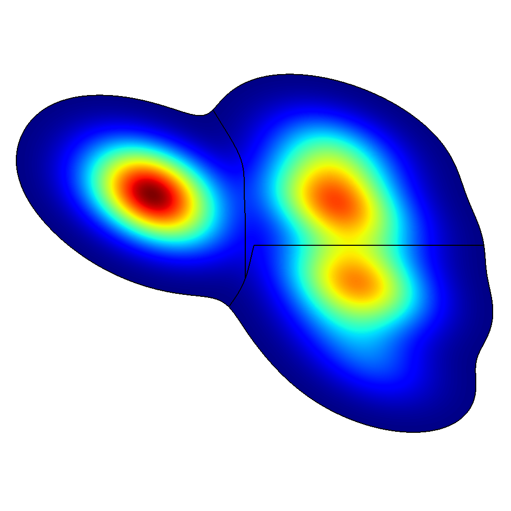

# Clustering t-SNE Embeddings
### Unsupervised clustering of high-dimensional points using t-SNE and the watershed algorithm.

Behaviors of organisms are sometimes encoded as high-dimensional feature vectors. These vectors can then be embedded into a 2D plot, often called the _behavior space_ :

<br>
<p align='center'>

</p>

### Usage
Install conda environment, activate it and run the following command in your terminal:

```bash
python main.py -path data.csv
```

### References:

Berman, Gordon J., et al. "Mapping the stereotyped behaviour of freely moving fruit flies." Journal of The Royal Society Interface 11.99 (2014): 20140672.