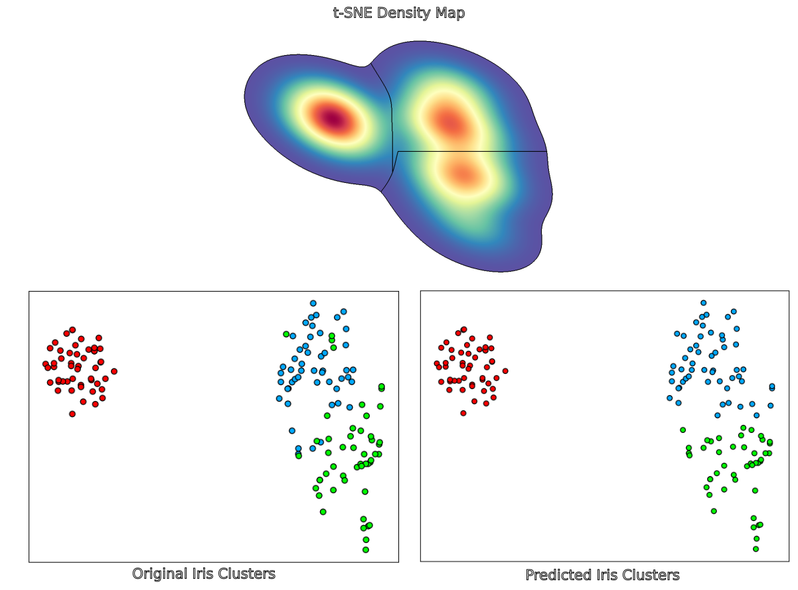

# Clustering t-SNE Embeddings
### Unsupervised clustering of high-dimensional points using t-SNE and the watershed algorithm.

Behaviors of organisms are sometimes encoded as high-dimensional feature vectors. These vectors can then be embedded into a 2D plot, often called the *behavior space*. This technique can also be used to classify species based on thier respective feature representations to obtain groups/clusters of species which share similar features. The following figure shows the result obtained from the famous Iris dataset, which contains 4 attributes values (*sepal*|*petal* *length*|*width*) for 3 different flower species:

<br>
<p align='center'>

</p>


## Usage
Install conda environment, activate it and run the following command in your terminal:

```bash
python main.py -path data.csv
```

The program outputs the cluster memberships and the density plot.

**Note**: The data must be a (n_instances, n_features) .csv file. The program also supports other embedding methods (PCA and Isomap).

## References:

Berman, Gordon J., et al. "Mapping the stereotyped behaviour of freely moving fruit flies." Journal of The Royal Society Interface 11.99 (2014): 20140672.